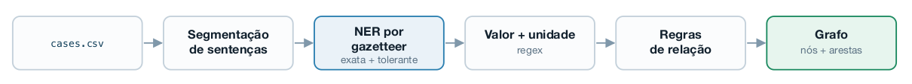
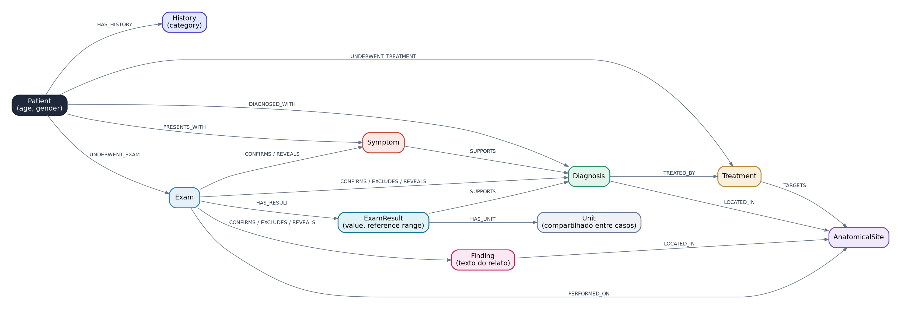
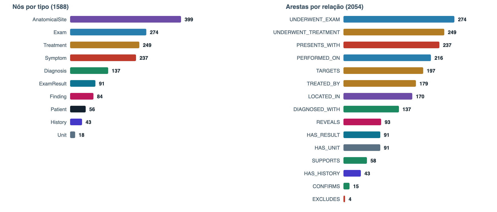
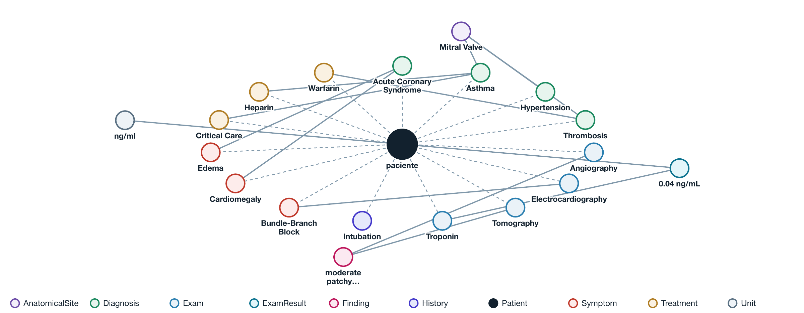

# Projeto `Grafo de Conhecimento a partir de Casos Clínicos`
# Project `Knowledge Graph from Clinical Case Reports`

**Equipe:** Mateus Farha, Lucas Lembo, Gustavo Rodrigues, Gabriela Coppo, João Azeredo

## Slides

[Apresentação (PDF)](assets/slides/apresentacao.pdf)

## Metodologia

A ideia foi extrair um grafo de conhecimento dos relatos de caso do MultiCaRe
usando só técnicas clássicas de NLP: regex, dicionário e regras. Nenhum modelo
de linguagem ou NER estatístico participa da extração.

O pipeline tem 5 etapas:

Cada caso chega como um parágrafo corrido em `case_text`. As colunas `age` e
`gender` já vêm estruturadas e viram direto os atributos do nó `Patient`, sem NLP.

### 1. Segmentação de sentenças

Toda regra que vem depois precisa de uma janela delimitada para decidir o que se
relaciona com o quê. Sem esse recorte, um sintoma do primeiro parágrafo seria
ligado a um diagnóstico do último só por estarem no mesmo texto.

Escolhemos a sentença como granularidade. A palavra perde o contexto que dá
sentido à relação, e o parágrafo (ou o caso inteiro) relaciona coisas que só
estão perto por acaso. A sentença é onde o autor do relato agrupa um fato
clínico completo.

A segmentação é uma expressão regular: pontuação final seguida de espaço e de
letra maiúscula ou abre parêntese. Sem tokenizador externo e sem download de modelo.

~~~python
_SENTENCE_SPLIT_RE = re.compile(r"(?<=[.!?])\s+(?=[A-Z(])")
~~~

O corpus fica com 1.426 sentenças em 56 casos, uma média de 25,5 por caso.

### 2. NER por gazetteer

As entidades `Symptom`, `Diagnosis`, `Exam`, `Treatment` e `AnatomicalSite`
precisam ser encontradas no texto livre. Como não podíamos usar LLM nem NER
estatístico, a saída foi um gazetteer: uma lista de termos por tipo de entidade,
procurada no texto.

**Fonte: MeSH.** O [MeSH](https://www.nlm.nih.gov/mesh/) (*Medical Subject
Headings*) é o vocabulário controlado da National Library of Medicine usado para
indexar artigos no PubMed. Escolhemos ele porque:

- sem uma taxonomia assim, seria preciso escrever à mão cinco listas com
  milhares de termos médicos;
- é público e sem licença, ao contrário de UMLS e SNOMED CT, que exigem
  cadastro e aprovação;
- o próprio dataset já usa esse vocabulário (`metadata.csv` traz
  `major_mesh_terms` por artigo), o que permite validar a extração contra uma
  anotação externa;
- é organizado em árvore por código (`TreeNumber`), então um único arquivo
  (`desc2025.xml`) cobre os 5 tipos, só trocando o prefixo do filtro.

| Entidade | Ramo MeSH | Cobre |
|---|---|---|
| `Symptom` | `C23` | sinais e sintomas |
| `Diagnosis` | `C` exceto `C23` | doenças |
| `Exam` | `E01` | procedimentos diagnósticos |
| `Treatment` | `D` + `E02` | substâncias, drogas e procedimentos terapêuticos |
| `AnatomicalSite` | `A` | anatomia |

**Redução do dicionário.** Cada descritor do MeSH traz em média 8 ou 9 grafias
do mesmo conceito, quase todas variação rara ou histórica. Somando tudo, são
265.700 termos. Mantendo só o termo preferido de cada conceito (atributo
`ConceptPreferredTermYN` do XML), sobram 61.439, uma redução de 4,3 vezes.

Essa redução importa por causa da busca tolerante (abaixo). A busca exata lê a
sentença uma vez, não importa o tamanho do dicionário. A tolerante compara a
palavra do texto com os termos da lista, então cada termo a mais é trabalho a mais.

| Dicionário | Termos | Busca | Motivo |
|---|---:|---|---|
| `symptom` | 2.137 | exata + tolerante | lista pequena, a tolerante roda rápido |
| `exam` | 1.329 | exata + tolerante | lista pequena, a tolerante roda rápido |
| `anatomical_site` | 3.061 | exata + tolerante | lista pequena, a tolerante roda rápido |
| `diagnosis` | 9.133 | só exata | grande demais para a busca tolerante |
| `treatment` | 26.765 | só exata | grande demais para a busca tolerante |

Em `diagnosis` e `treatment` medimos cerca de 3 segundos por sentença na busca
tolerante, o que daria mais de uma hora nas 1.426 sentenças. Por isso esses dois
ficaram só com busca exata.

**Busca exata: Aho-Corasick.** São cerca de 42 mil termos nos cinco dicionários
e 1.426 sentenças; procurar termo por termo daria cerca de 60 milhões de buscas. O
Aho-Corasick monta um autômato com todos os termos de uma vez, numa árvore de
letras em que termos que começam igual compartilham o mesmo caminho. A sentença
é lida uma única vez, letra por letra, e quando a letra quebra o caminho o
autômato pula para o maior final já lido que ainda serve de começo de outro
termo, sem voltar no texto. O custo é proporcional ao tamanho do texto, não ao
número de termos. Quando dois termos casam no mesmo trecho, vence o mais longo:
em *"...started immediately on heparin infusion for suspicion of acute coronary
syndrome..."*, `acute coronary syndrome` vence `coronary`.

**Busca tolerante: Damerau-Levenshtein + BK-tree.** A busca exata perde
variação leve de escrita (`heart-attack` no texto não casa com `heart attack`
no dicionário). A distância de Damerau-Levenshtein conta o número mínimo de
edições (inserir, remover, substituir ou trocar duas letras de posição) para
transformar uma palavra na outra. Para não comparar a palavra com os 3.061
termos de `anatomical_site` um por um, os termos ficam numa BK-tree, que
organiza o dicionário pela distância entre os próprios termos e descarta galhos
inteiros sem comparar.

Os limites que colocamos (em `config.py`):

- no máximo **1 edição** (`FUZZY_MAX_ABS_DISTANCE`); erro maior que isso só é
  recuperado pela busca exata;
- janelas de **1 palavra** (`MAX_FUZZY_WINDOW_WORDS`), porque o objetivo é
  erro de escrita e não frase parafraseada;
- só em `symptom`, `exam` e `anatomical_site` (`FUZZY_ENTITY_TYPES`).

A busca tolerante só roda no que sobrou livre depois da exata, e uma máscara de
posições ocupadas evita que duas entidades se sobreponham.

**Nem toda substância é um tratamento.** A lista de `Treatment` vem do ramo `D`
do MeSH ("Chemicals and Drugs"), que não distingue droga administrada de
substância medida num exame. Sem tratar isso, *"hemoglobin was 9 g/dL"* vira
"o paciente foi tratado com hemoglobina". Separar à mão também não funciona,
porque a mesma substância aparece nos dois papéis, às vezes no mesmo caso. Em
`PMC9529523_01`:

| Trecho | Papel |
|---|---|
| "The patient was **started on** hydroxychloroquine 300 mg daily" | remédio, tem verbo de administração |
| "The **serum** hydroxychloroquine **level was** 1232.1 ng/ml" | exame, tem valor medido |

A decisão então olha o texto ao redor: se não há verbo de administração até 40
caracteres antes (`treated with`, `given`, `started on`...) e há número com
unidade até 20 caracteres depois, a substância é reclassificada como `Exam`.
Em `PMC5137649_01`, *"a carcinoembryonic antigen (CEA) level of 12,476.5
ng/mL"* virou `Exam`.

### 3. Valor + unidade

Os valores numéricos de exame viram nós `ExamResult`. A lista de unidades é um
arquivo de texto, [`units.txt`](references/vocabularies/units.txt), com uma
unidade por linha, curada à mão (50 no total: `mg/dL`, `ng/mL`, `mmHg`, `%`,
`cm`...). Aqui não tem tolerância a erro de escrita: unidade é curta, e aceitar
1 edição em `L` faria a letra casar com qualquer inicial solta no texto.

O regex é montado em tempo de execução a partir do arquivo. As unidades são
ordenadas por tamanho decrescente (para `mg/dL` ganhar de `mg`) e viram
alternativas de um mesmo grupo:

~~~python
unit_alt = "|".join(re.escape(u) for u in units)
pattern = re.compile(
    rf"(?P<value>\d[\d,\.]*)\s*(?P<unit>{unit_alt})\b"
    rf"(?:\s*,?\s*reference range\s*(?P<ref_low>\d[\d,\.]*)\s*-\s*(?P<ref_high>\d[\d,\.]*))?",
    re.IGNORECASE,
)
~~~

A vantagem é operacional: acrescentar uma unidade é editar uma linha do arquivo,
sem tocar no código. Um `ExamResult` só é criado quando o valor aparece até 20
caracteres depois de um `Exam` (ex.: *"Initial troponin was normal at 0.04 ng/mL"*).

### 4. Regras de relação

Nesse ponto os nós já existem, mas estão soltos. A ligação é feita em duas camadas.

**Camada automática.** Toda entidade encontrada liga direto no paciente, e o
tipo do nó já determina a relação: se achamos um sintoma no caso, o paciente
apresenta aquele sintoma. Isso gera `PRESENTS_WITH`, `DIAGNOSED_WITH`,
`UNDERWENT_EXAM`, `UNDERWENT_TREATMENT` e `HAS_HISTORY`, que são justamente as
arestas mais numerosas do grafo.

**Entidade com entidade.** Aqui não há nada óbvio a copiar, e usamos duas ferramentas:

- **Co-ocorrência** descobre *que* existe ligação: duas entidades na mesma
  sentença provavelmente se relacionam. A aposta é que a sentença é a unidade de
  assunto do relato. É barato, funciona na maioria dos casos e erra quando a
  sentença junta coisas por acaso.
- **Gatilho textual** descobre *qual* é a ligação e o sinal dela. Os gatilhos
  ficam em [`triggers.csv`](references/vocabularies/triggers.csv), cada um com
  polaridade e uso:

| Gatilho no texto | Sinal | Relação criada |
|---|---|---|
| `confirmed`, `consistent with`, `positive for` | positivo | `CONFIRMS` |
| `excluded`, `ruled out`, `no evidence of` | negativo | `EXCLUDES` |
| `showed`, `revealed`, `demonstrated` | neutro | `REVEALS` |

A polaridade é o que impede o grafo de afirmar o contrário do que o caso diz:
*"no evidence of malignancy"* registra que o exame descartou o diagnóstico, e
não que o paciente tem malignidade. Há ainda gatilhos de outro uso: `history of`
(e variações como `h/o`, `prior`) marca passado clínico, e `treated with`,
`given` etc. marcam administração de droga.

As regras, uma por uma:

| Quando a sentença traz | O grafo recebe |
|---|---|
| `history of X` (até 80 caracteres antes) | `X` deixa de ser ocorrência atual e vira nó `History` |
| exame sem valor numérico, com gatilho por perto | aresta `CONFIRMS`/`EXCLUDES`/`REVEALS` para um `Diagnosis`/`Symptom` da sentença, ou um nó `Finding` com o texto cru quando nada bate no vocabulário |
| sintoma (ou resultado de exame) e diagnóstico juntos | `Symptom`/`ExamResult` `SUPPORTS` `Diagnosis` |
| tratamento depois de um diagnóstico | `Diagnosis` `TREATED_BY` `Treatment` |
| local anatômico e exame juntos | `Exam` `PERFORMED_ON` `AnatomicalSite` |
| local anatômico e diagnóstico (ou achado) juntos | `Diagnosis`/`Finding` `LOCATED_IN` `AnatomicalSite` |
| local anatômico e tratamento juntos | `Treatment` `TARGETS` `AnatomicalSite` |

As três últimas são co-ocorrência pura: mudam de nome só porque o outro lado da
ligação é um exame, um diagnóstico ou um tratamento. Quase toda regra olha
apenas a sentença; `TREATED_BY` é a exceção, porque guarda o último diagnóstico
visto e liga a ele qualquer tratamento posterior, mesmo várias sentenças depois.

O código completo está em [`src/kg_extraction/`](src/kg_extraction/), com
[instruções de instalação e execução](src/README.md).

## Trabalhos Estudados

- **MultiCaRe** (Nievas Offidani et al., 2025): artigo do dataset. Usamos para
  entender como os casos foram coletados do PubMed Central e o que cada coluna
  de `cases.csv` e `metadata.csv` representa, inclusive os `major_mesh_terms`
  que motivaram a escolha do MeSH.
- **Survey de grafos de conhecimento** (Ji et al., 2022): base para a parte de
  representação e para separar o que é aquisição de entidades do que é extração
  de relações.
- **Aho-Corasick** (Aho & Corasick, 1975), **Damerau-Levenshtein** (Damerau,
  1964; Lowrance & Wagner, 1975) e **BK-tree** (Burkhard & Keller, 1973): os
  artigos originais dos algoritmos que implementamos na etapa de NER.
- **MeSH** (documentação da NLM): estrutura do XML de descritores, significado
  dos `TreeNumber` e do atributo `ConceptPreferredTermYN`.

## Modelo Lógico

O grafo é salvo em duas tabelas, seguindo o esquema do enunciado:

- **nós** ([`nodes.csv`](data/processed/nodes.csv)): `node_id`, `case_id`, `type`, `label`, `attributes`
- **arestas** ([`edges.csv`](data/processed/edges.csv)): `edge_id`, `case_id`, `source_id`, `target_id`, `relation`, `attributes`

São 10 tipos de nó (`Patient`, `History`, `Symptom`, `Diagnosis`, `Exam`,
`ExamResult`, `Finding`, `Treatment`, `AnatomicalSite`, `Unit`) e 15 relações
(`HAS_HISTORY`, `PRESENTS_WITH`, `UNDERWENT_EXAM`, `UNDERWENT_TREATMENT`,
`HAS_RESULT`, `HAS_UNIT`, `DIAGNOSED_WITH`, `SUPPORTS`, `TREATED_BY`,
`CONFIRMS`, `EXCLUDES`, `REVEALS`, `LOCATED_IN`, `TARGETS`, `PERFORMED_ON`).

### O que vira nó e o que fica como atributo

Usamos três testes, aplicados ao exame de troponina do caso `PMC7102447_01`,
que mediu `0.04 ng/mL`:

| Teste | Pergunta | `ng/mL` | `0.04` |
|---|---|---|---|
| Reuso | reaparece em outros casos e deve apontar para o mesmo nó? | sim | não, é coincidência numérica |
| Consulta | a pergunta sobre ele se responde percorrendo aresta? | sim, "quais exames usam esta unidade" | não, `troponina > 0.03` é comparação |
| Identidade | existe fora do exame que o carrega? | sim | não |

Por isso `Unit` virou nó compartilhado entre casos (a mesma unidade sempre
aponta para o mesmo nó, sem `case_id`), e valor e faixa de referência ficaram
como texto em `attributes` do `ExamResult`. Decompor tudo não é obrigatório, pois
inflaria o grafo sem responder nenhuma pergunta nova.

## Análises que podem ser realizadas

- **Validação contra anotação externa:** cruzar os `major_mesh_terms` de
  `metadata.csv` com os `Diagnosis`/`Symptom` extraídos de cada artigo. Como os
  dois lados vêm do MeSH, a comparação é direta.
- **Protocolos diagnósticos recorrentes:** para cada `Diagnosis`, quais `Exam`
  aparecem com mais frequência nos casos que o têm (via `UNDERWENT_EXAM` +
  `DIAGNOSED_WITH`, ou diretamente por `CONFIRMS`/`REVEALS`).
- **Sintomas que sustentam um diagnóstico:** agregar `SUPPORTS` entre casos
  para ver quais sintomas e resultados de exame mais acompanham cada doença.
- **Uso de unidades:** como `Unit` é compartilhado, "quais exames são medidos
  em `ng/mL`" é uma consulta de um salto a partir do nó da unidade.
- **Cobertura do gazetteer:** contar sentenças sem nenhuma entidade para achar
  lacunas do MeSH (ex.: exames que o texto nomeia de um jeito e o MeSH de outro).
- **Qualidade por tipo:** comparar a precisão de `Symptom` e `Diagnosis`,
  já que o ramo `C23` do MeSH mistura doenças específicas com sintomas.

## Ferramentas

- **Python + pandas**: todo o pipeline. O resto (regex, leitura do XML, CSV) é
  biblioteca padrão; `pandas` é a única dependência ([`requirements.txt`](requirements.txt)).
- **Implementações próprias** de Aho-Corasick, Damerau-Levenshtein e BK-tree
  ([`src/kg_extraction/features/`](src/kg_extraction/features/)).
- **MeSH 2025 (NLM)**: vocabulário controlado para os gazetteers. O XML
  (~314 MB) não vai para o repositório; o `mesh_parser.py` gera os CSVs de
  [`references/vocabularies/`](references/vocabularies/) a partir dele.
- **Cytoscape.js**: visualizador de grafos por caso
  ([`scratch/build_viewer.py`](scratch/build_viewer.py) gera
  `scratch/graph_viewer/index.html`), com layout concêntrico em que cada tipo
  de nó fica num anel ao redor do paciente.
- **Estrutura do repositório**: baseada no
  [Cookiecutter Data Science](https://drivendata.github.io/cookiecutter-data-science/), simplificada.

## Resultados

O pipeline rodou sobre os **56 casos / 50 artigos** da amostra
(`data/raw/multicare/cases.csv`) em cerca de 2 minutos.

O grafo final tem **1.588 nós e 2.054 arestas**. O que os números mostram:

- **`AnatomicalSite` é o tipo mais numeroso (399).** Quase toda frase clínica
  menciona uma parte do corpo, e o ramo `A` do MeSH é o de cobertura mais
  generosa. É também o tipo com mais ruído, porque casa com palavras usadas fora
  do sentido clínico.
- **`UNDERWENT_EXAM` é a relação mais frequente (274).** Isso reflete o gênero
  do texto: relato de caso é construído em cima da investigação diagnóstica,
  não do tratamento.
- **Co-ocorrência anatômica responde por 28% do grafo.** `PERFORMED_ON`,
  `TARGETS` e `LOCATED_IN` somam 583 das 2.054 arestas, ou seja, mais de um
  quarto das ligações vem de proximidade no texto e não de evidência explícita.
- **Os gatilhos de polaridade aparecem pouco.** `REVEALS` (neutro) tem 93
  arestas, contra 15 de `CONFIRMS` e 4 de `EXCLUDES`. Os relatos descrevem mais
  o que o exame mostrou do que o que ele confirmou ou descartou.

### Um caso, do texto ao grafo

`PMC7102447_01`: *"A 65-year-old male with a past medical history significant
for hypertension, asthma, and minimally invasive bioprosthetic mitral valve
replacement... presented with severe respiratory distress requiring emergent
intubation."*

As linhas tracejadas que saem do paciente são a camada automática, onde o tipo do nó
já diz qual é a relação. As linhas cheias são as inferidas pelas regras de
co-ocorrência e gatilho. A cor identifica o tipo do nó, conforme a legenda; o nome
de cada relação foi omitido do desenho porque, num grafo desta densidade, o rótulo
cai sobre o nome dos nós vizinhos, e o vocabulário de relações está na tabela da
seção anterior. Ao todo, o caso tem 19 nós e 28 arestas.

O caso mostra bem o que funciona e o que não funciona. Funcionam a cadeia
`Troponin → 0.04 ng/mL → ng/ml` (exame, resultado e unidade compartilhada),
`Electrocardiography REVEALS Bundle-Branch Block`, `Edema` e `Cardiomegaly`
dando `SUPPORTS` para `Acute Coronary Syndrome` e `Thrombosis TREATED_BY
Warfarin`. Mas também aparecem os erros das regras: `Asthma TREATED_BY Heparin`
vem do `TREATED_BY` ligar o tratamento ao último diagnóstico visto, e
`Hypertension LOCATED_IN Mitral Valve` é co-ocorrência pura, porque os dois
estão na mesma sentença do histórico.

### Limitações conhecidas

- **O MeSH não foi criado para esta finalidade.** Ele existe para catalogar
  artigos do PubMed, e nós o usamos para tipar menções em texto clínico. Onde os
  dois propósitos não coincidem, a entidade pode sair no tipo errado. O ramo
  `C23`, por exemplo, tem uma subárvore "Chronic Disease" que lista doenças
  específicas, então algumas entidades que deveriam ser `Diagnosis` saem como
  `Symptom`; e palavras como "serum" e "tail" casam com `AnatomicalSite` fora
  do sentido clínico.
- **A cobertura de `Exam` tem buracos.** Nem todo exame comum tem descritor
  MeSH com o nome que o texto usa. O ultrassom endoscópico está catalogado como
  `endosonography`, então `endoscopic ultrasound` e a sigla `EUS`, que são as
  formas que o relato escreve, não casam com nada e o exame não entra no grafo.
- **Sobra ambiguidade em `Treatment`.** A reclassificação da substância só
  funciona quando o valor está colado no texto, dentro de 20 caracteres.
  *"hemoglobin was 9 g/dL"* é reconhecido; *"hemoglobin was low, and was later
  measured at 9 g/dL"* passa da janela e escapa.
- **Termos genéricos colidem com palavra comum.** Alguns descritores do MeSH
  são palavras corriqueiras do inglês, então *"a diagnosis of pneumonia was
  made"* criaria um nó de exame chamado "Diagnosis". Bloqueamos três desses à
  mão (`Diagnosis`, `Therapeutics` e `Pharmaceutical Preparations`, em
  `EXCLUDED_MESH_UI` no `config.py`) a partir dos falsos positivos que vimos
  rodando o pipeline. A lista foi curada olhando estes 56 casos, então em texto
  novo outros vão aparecer.
- **`AnatomicalSite` só se liga por co-ocorrência.** 195 dos 399 nós (49%)
  ficam sem nenhuma aresta, porque são menções soltas sem outra entidade na
  mesma sentença. E as que se ligam dependem de proximidade no texto, não de
  uma relação semântica de verdade.
- **`Finding` guarda texto cru.** O trecho é recortado por janela de
  caracteres a partir do gatilho, então às vezes começa ou termina no meio de
  uma palavra.
- **Arestas duplicadas.** Quando a mesma dupla de entidades reaparece em mais
  de uma sentença do caso, a co-ocorrência registra a ligação outra vez: são
  2.054 arestas gravadas contra 1.941 distintas. As 113 repetições concentram-se
  justamente em `TARGETS`, `PERFORMED_ON` e `LOCATED_IN`, então o percentual de
  co-ocorrência anatômica acima está contado sobre arestas gravadas, não
  distintas.

## Como Modelos de Linguagem foram Usados

- **Nenhum LLM na técnica de extração.** NER, valores e relações são 100%
  regra, dicionário e regex, sem nenhuma chamada a modelo de linguagem em tempo
  de execução (ver [`src/kg_extraction/features/`](src/kg_extraction/features/)).
- LLM usado para escrever partes do código do pipeline e, integralmente, para
  criar a interface de visualização dos grafos, que o enunciado libera para uso de IA.
- LLM usado como ferramenta de consulta sobre os métodos de extração e os
  conceitos abordados no projeto.
- Revisão e formatação dos slides da apresentação e deste README.

## Referências Bibliográficas

- Nievas Offidani, M., Roffet, F., González Galtier, M. C., Massiris, M., &
  Delrieux, C. (2025). An Open-Source Clinical Case Dataset for Medical Image
  Classification and Multimodal AI Applications. *Data*, 10(8), 123.
  https://doi.org/10.3390/DATA10080123
- Ji, S., Pan, S., Cambria, E., Marttinen, P., & Yu, P. S. (2022). A Survey on
  Knowledge Graphs: Representation, Acquisition, and Applications. *IEEE
  Transactions on Neural Networks and Learning Systems*, 33(2), 494–514.
  https://doi.org/10.1109/TNNLS.2021.3070843
- Aho, A. V., & Corasick, M. J. (1975). Efficient String Matching: An Aid to
  Bibliographic Search. *Communications of the ACM*, 18(6), 333–340.
  https://doi.org/10.1145/360825.360855
- Damerau, F. J. (1964). A Technique for Computer Detection and Correction of
  Spelling Errors. *Communications of the ACM*, 7(3), 171–176.
  https://doi.org/10.1145/363958.363994
- Lowrance, R., & Wagner, R. A. (1975). An Extension of the String-to-String
  Correction Problem. *Journal of the ACM*, 22(2), 177–183.
  https://doi.org/10.1145/321879.321880
- Burkhard, W. A., & Keller, R. M. (1973). Some Approaches to Best-Match File
  Searching. *Communications of the ACM*, 16(4), 230–236.
  https://doi.org/10.1145/362003.362025
- National Library of Medicine. *Medical Subject Headings (MeSH)*.
  https://www.nlm.nih.gov/mesh/
- Cookiecutter Data Science. https://drivendata.github.io/cookiecutter-data-science/
